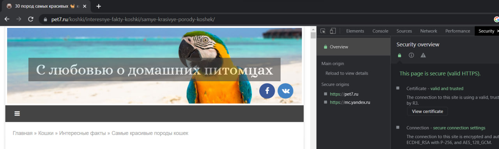
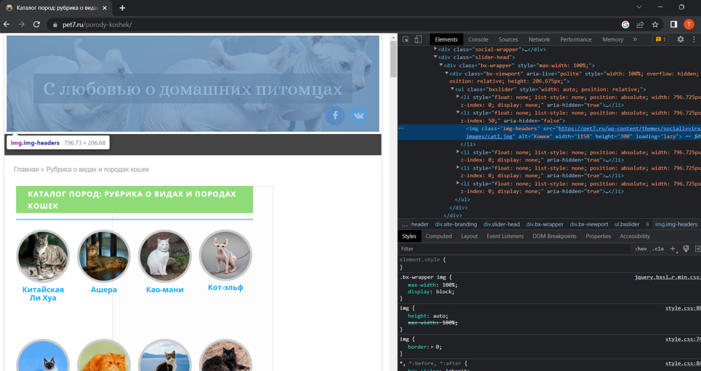
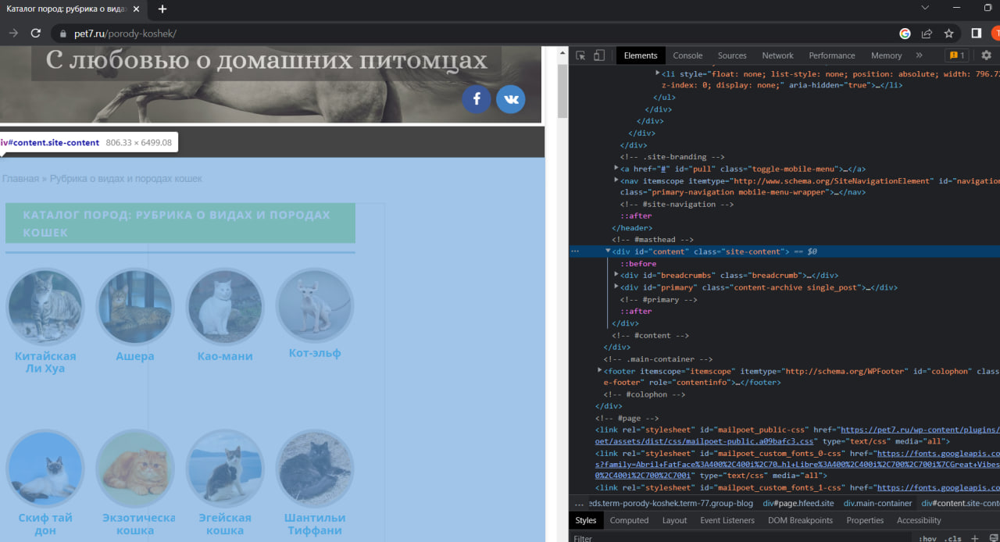
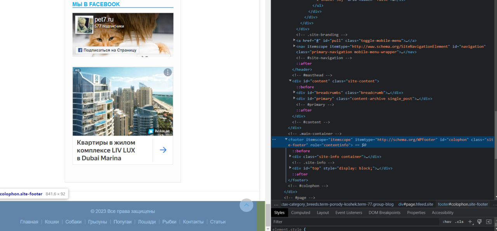
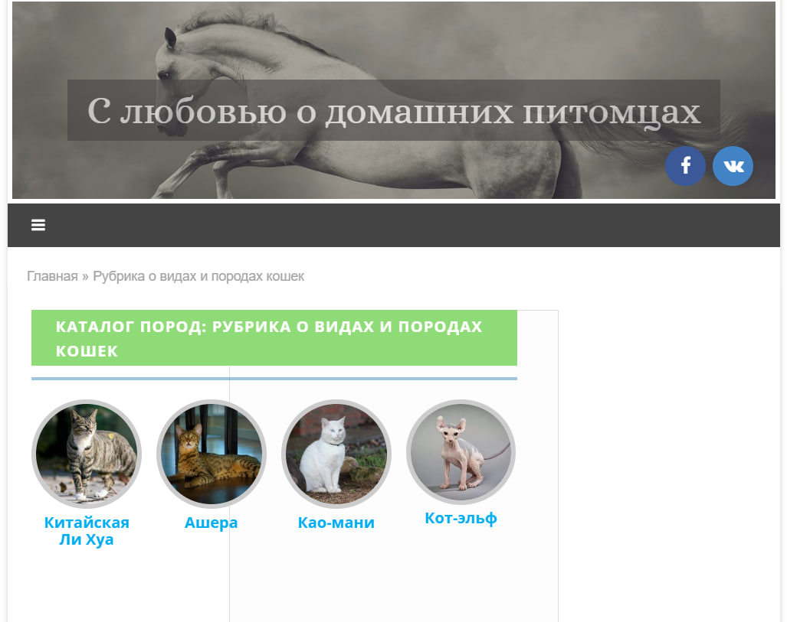
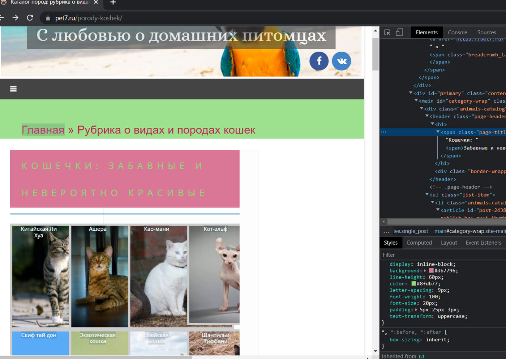
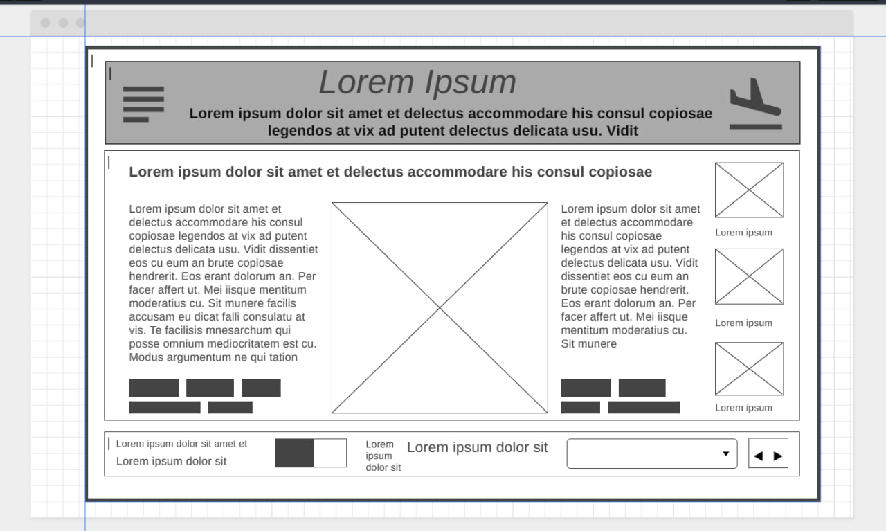

## Урок 1. Веб-технологии: вчера, сегодня, завтра
### **Задача:**
 на основе сайта https://pet7.ru/koshki/interesnye-fakty-koshki/samye-krasivye-porody-koshek/

1. Определите, на каком протоколе работает сайт.

2. Проанализируйте структуру страницы сайта.

3. Внесите не менее 3 изменения на страницу с помощью инструмента разработчика и представьте скриншоты было/стало.

4. Создайте прототип низкой детализации (дополнительное задание, если на семинаре дошли до задания №8).

### **Выполнение задания**:

1. Сайт работает на протоколе HTTPS

2. Структура страницы:
* ***Header***

* ***Content***

* ***Footer***

3. Изменения:

***Было***

***Стало***

4. Прототип низкой детализации

